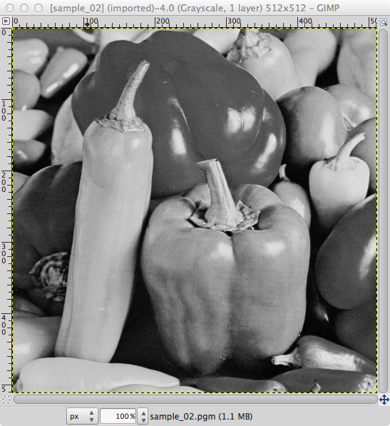
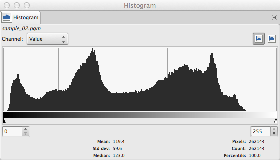

# Tutorial 02 - Grayscale Image Operations

After reading your image from a file into memory, you may want to optimize its histogram using gray value transforms. This tutorial will tech you the basics.

## Pattern for gray value transforms
You can use the following pattern for your gray value transforms.

```c++
template <class P> void MyTransform(NICE::ImageT<P>& image)
{
	for(int x = 0; x < image.width(); x++) {
		for(int y=0; y < image.height(); y++) {
			P pixel = image.getPixelQuick(x, y);
			// Insert transform here	
			image.setPixelQuick(x, y, pixel);
		}
	}
}
```

Note that the get/setPixelQuick Methods don't perform boundary checks!

### Optimization
If you have access to Intel IPP, you can use the overloaded operators provided in ImageOperators.h.

Another easy way to improve performance is adding a "parallel for" OpenMP compilation hint.

## Gamma transforms
Gamma transforms are a little more complicated, because gray values are not always in the [0,1] range.
For example, the _Image_ and _GrayImage16s_ use the full positive range of their data types while the _FloatImage_ class can handle arbitrary ranges.

You can use the __max()__ and __min()__ methods on your image to find its specific range. 

## Histogram
NICE provides a _Histogram_ class for 8-bit grayscale and color images (_Image_ and _ColorImage_).
To calculate an image's histogram, use the constructor:

``` c++
NICE::Histogram histogram(image, 0, 256);
```

# Sample code
This sample program attempts to equalize an image's histogram by deriving a
gray value transform from the cumulative histogram.

Take this :
the  shows that it doesn't make
use of the whole range of gray values.
After running the sample program, the image should look like
.
We can see in its  that is uses
the complete range now.

## Includes and file names
Just like the previous sample, the program needs input and output file names.
It also uses the _ImageT_ and _ImageFile_ classes, but needs the relevant
headers for _Histogram_ and _VectorT_ as well.

```c++
#include <iostream>
#include <string>
#include <core/image/ImageT.h>
#include <core/image/ImageFile.h>
#include <core/image/Histogram.h>
#include <core/vector/VectorT.h>
```

The command line is then checked and stored like in the first sample. Most
sample programs will use this pattern.

```c++
// Check if enough parameters were supplied
if (argc < 3) {
	std::cout << "USAGE: " << argv[0] << " <input image> <output image>\n";
	return -1;
}

// These are our file names
std::string input_path(argv[1]);
std::string output_path(argv[2]);
```

## Calculating the histogram
We read the image file specified as a command line argument using _ImageFile_
like we learned in the first tutorial. This time we don't use _ColorImage_,
because the sample program describes a gray value transform.

When constructing a _Histogram_, we need to specify the range of gray values
in our image. 8-bit images have values ranging from 0 to 255, but while the
histogram includes the lower boundary as a bin, it does not include the upper
boundary because it uses the difference between the boundarys to calculate the
number of bins. This is why the sample program uses the values 0 and 256.

The cumulative functions doesn't return another _Histogram_, but an _IntVector_.

```c++
// Read image into memory
NICE::ImageFile source_file(input_path);
NICE::Image image;
source_file.reader(&image);

// Calculate cumulative histogram
NICE::Histogram histogram(image, 0, 256);
NICE::IntVector* cumulative_histogram = histogram.cumulative();
```

## The transform
In theory, if we use the cumulative histogram as a mapping for our gray value
transform, the resulting image has a perfectly uniform histogram. We can prove
this for images that are continuously differentiable functions of real numbers.
This is not the case for digital images:
suppose an image is filled with a single color.
There is no gray value transform that can turn this image into one with a
uniform distribution of gray values.

We also need to scale the cumulative histogram down to our 8-bit range.
The largest value will match the total number of pixels in the source image,
so we use that to calculate a scaling factor.

```c++
double factor = 255.0/(double)(image.width()*image.height());

// Transform using our pattern
for(int x = 0; x < image.width(); x++) {
	for(int y=0; y < image.height(); y++) {
		// This is the old gray value
		Ipp8u pixel = image.getPixelQuick(x, y);

		// We use it as and index into the cumulative histogram to
		// computer the new one. This has to be scaled appropriately
		// using our precomputed factor.
		double new_pixel_f =
				((double)cumulative_histogram->get(pixel))*factor;

		// The pixel format is 8-bit integer, so we have to convert
		// the result
		Ipp8u new_pixel = static_cast<Ipp8u>(new_pixel_f + 0.5);

		// ..and save it
		image.setPixelQuick(x, y, new_pixel);

	}
}
```

We can now write the changed image back to disk. We use a new file to preserve
the original.

```c++
NICE::ImageFile dest_image(output_path);
dest_image.writer(&image);
return 0;
```
